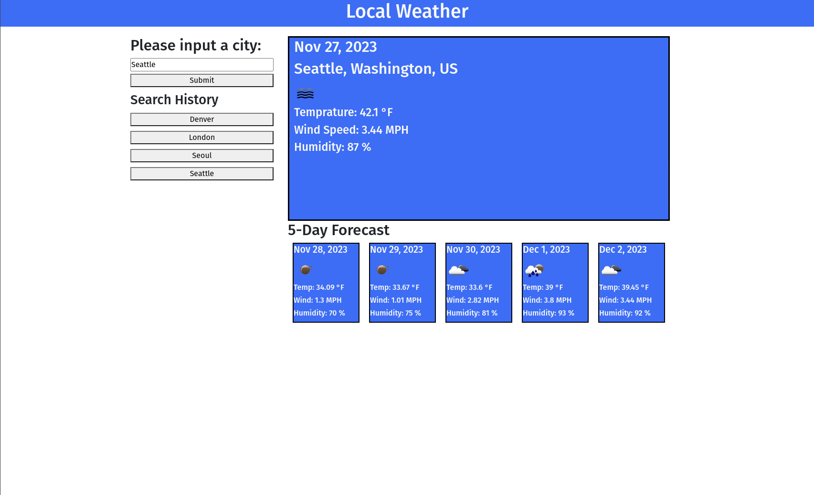

# weather-application-evank

A simple weather app that gives current weather data as well as a five day forecast for a given location. Webpage can be found at https://33649ek.github.io/weather-application-evank/.

## Usage

Inputting a city name into the location field and pressing submit will bring up weather data for that location and create a button under the search history header. Pressing one of these buttons will bring up the weather data for that respective location.

## Installation

N/A

## Credits

ChatGPT helped write one line of code in the JavaScript file.

## License

MIT License